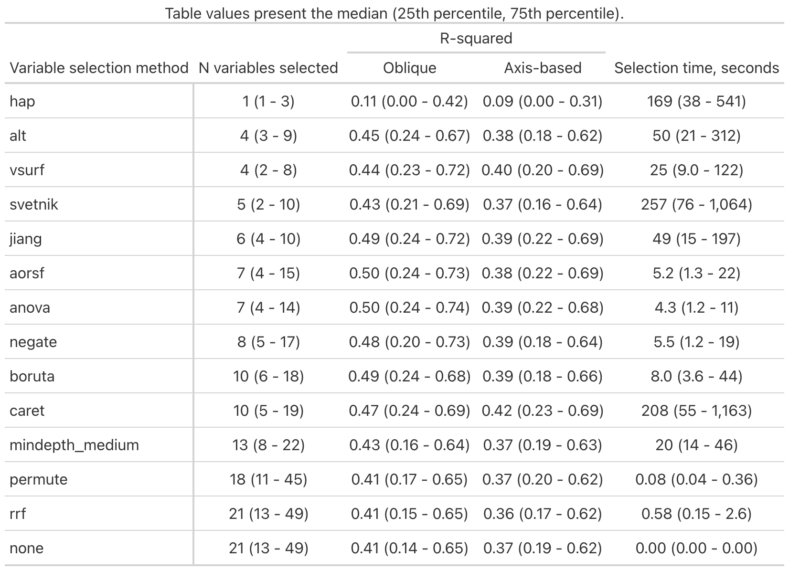
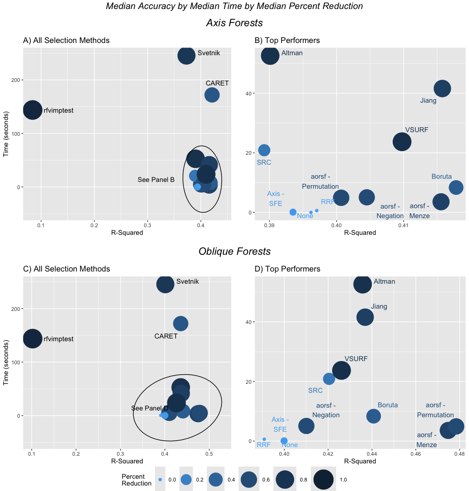

<!-- README.md is generated from README.Rmd. Please edit that file -->

# rfvs-regression

<!-- badges: start -->
<!-- badges: end -->

The goal of rfvs-regression is to compare random forest variable
selection techniques for continuous outcomes

# Datasets included

# Central illustration

The experiment we ran involves three steps:

1.  Select variables with a given method.
2.  Fit a random forest to the data, including only selected variables.
3.  Evaluate prediction accuracy of the forest in held-out data.

*Note*: We use both axis-based and oblique random forests for regression
in step 2.

We assume that better variable selection leads to better prediction
accuracy. Results from the experiment are below.

Similar results, but using mean and standard error

<!-- -->

<!-- -->

*Takeaways*:

1.  Variable selection method `jiang` has consistently high prediction
    accuracy but scales poorly to large datasets in terms of
    computational efficiency. E.g., the max time that this method
    required was 7 minutes, 1 seconds

2.  Variable selection method `aorsf` has very high prediction accuracy
    when the downstream model is an oblique random forest, and does not
    become computationally intractable with larger data. E.g., the max
    time this method required was 29 seconds
